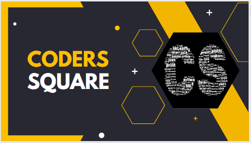

  

# Python Data Structures and Algorithms

Welcome to our repository focused on Python data structures and algorithm problems! This repository is designed to provide a collection of problems, explanations, and solutions related to fundamental data structures and algorithms.

## Introduction

In this repository, we explore various data structures and algorithms using Python. Whether you're a beginner looking to enhance your coding skills or an experienced developer diving into data structures, you'll find valuable content here.

# Contents:

## Basic

1. [Math Based Problems](https://github.com/Satyajit-Chaudhuri/Python-Tutorial-Series/blob/main/DSA/Math_Approach_based_Problems.ipynb)
2. [List](https://github.com/Satyajit-Chaudhuri/Python-Tutorial-Series/blob/main/DSA/Lists_in_Python.ipynb)
3. [Searching](https://github.com/Satyajit-Chaudhuri/Python-Tutorial-Series/blob/main/DSA/Binary_Search_Algorithm.ipynb)
4. [Sorting](https://github.com/Satyajit-Chaudhuri/Python-Tutorial-Series/blob/main/DSA/Sorting.ipynb)
5. [Hashing](https://github.com/Satyajit-Chaudhuri/Python-Tutorial-Series/blob/main/DSA/Hashing.ipynb)
6. [Linked List](https://github.com/Satyajit-Chaudhuri/Python-Tutorial-Series/blob/main/DSA/Linked%20List.ipynb)
7. [Stack](https://github.com/Satyajit-Chaudhuri/Python-Tutorial-Series/blob/main/DSA/Stack.ipynb)
8. [Queue](https://github.com/Satyajit-Chaudhuri/Python-Tutorial-Series/blob/main/DSA/Queue.ipynb)
9. [Deque](https://github.com/Satyajit-Chaudhuri/Python-Tutorial-Series/blob/main/DSA/Deque.ipynb)
10. [Tree](https://github.com/Satyajit-Chaudhuri/Python-Tutorial-Series/blob/main/DSA/Tree.ipynb)
11. [Binary Search Tree](https://github.com/Satyajit-Chaudhuri/Python-Tutorial-Series/blob/main/DSA/Binary_Search_Tree.ipynb)
12. [Heap](https://github.com/Satyajit-Chaudhuri/Python-Tutorial-Series/blob/main/DSA/Heap.ipynb)

## Advanced

1. [Bit Magic](https://github.com/Satyajit-Chaudhuri/Python-Tutorial-Series/blob/main/DSA/Bit_Magic.ipynb)
2. [List](https://github.com/Satyajit-Chaudhuri/Python-Tutorial-Series/blob/main/DSA/List_Advanced.ipynb)
3. [Recursion](https://github.com/Satyajit-Chaudhuri/Python-Tutorial-Series/blob/main/DSA/Recursion_Advanced.ipynb)
4. [Searching](https://github.com/Satyajit-Chaudhuri/Python-Tutorial-Series/blob/main/DSA/Searching_Advanced.ipynb)
5. [Sorting](https://github.com/Satyajit-Chaudhuri/Python-Tutorial-Series/blob/main/DSA/Sorting_Advanced.ipynb)
6. [Matrix](https://github.com/Satyajit-Chaudhuri/Python-Tutorial-Series/blob/main/DSA/Matrix_Advanced.ipynb)
7. [Hashing](https://github.com/Satyajit-Chaudhuri/Python-Tutorial-Series/blob/main/DSA/Hashing_Advanced.ipynb)
8. [String](https://github.com/Satyajit-Chaudhuri/Python-Tutorial-Series/blob/main/DSA/String_Advanced.ipynb)
9. [Linked List](https://github.com/Satyajit-Chaudhuri/Python-Tutorial-Series/blob/main/DSA/Linked_List_Advanced.ipynb)
10. [Stack](https://github.com/Satyajit-Chaudhuri/Python-Tutorial-Series/blob/main/DSA/Stack_Advanced.ipynb)
11. [Queue](https://github.com/Satyajit-Chaudhuri/Python-Tutorial-Series/blob/main/DSA/Queue_Advanced.ipynb)
12. [Tree]((https://github.com/Satyajit-Chaudhuri/Python-Tutorial-Series/blob/main/DSA/Tree_Advanced.ipynb)
13. [Binary Search Tree](https://github.com/Satyajit-Chaudhuri/Python-Tutorial-Series/blob/main/DSA/Binary_Search_Tree_Advanced.ipynb)
14. [Heap](https://github.com/Satyajit-Chaudhuri/Python-Tutorial-Series/blob/main/DSA/Heap_Advanced.ipynb)
15. [Graph](https://github.com/Satyajit-Chaudhuri/Python-Tutorial-Series/blob/main/DSA/Graph_Advanced.ipynb)
16. [Greedy](https://github.com/Satyajit-Chaudhuri/Python-Tutorial-Series/blob/main/DSA/Greedy_Advanced.ipynb)
17. [Backtracking](https://github.com/Satyajit-Chaudhuri/Python-Tutorial-Series/blob/main/DSA/Backtracking_Advanced.ipynb)
18. [DP](https://github.com/Satyajit-Chaudhuri/Python-Tutorial-Series/blob/main/DSA/DP_Advanced.ipynb)
19. [Trie](https://github.com/Satyajit-Chaudhuri/Python-Tutorial-Series/blob/main/DSA/Trie_Advanced.ipynb)
20. [Segment and Binary Indexed Trees](https://github.com/Satyajit-Chaudhuri/Python-Tutorial-Series/blob/main/DSA/Segment_and_Binary_Indexed_Trees.ipynb)
21. [Disjoint Set](https://github.com/Satyajit-Chaudhuri/Python-Tutorial-Series/blob/main/DSA/Disjoint_Sets_Advanced.ipynb)

    
## Resources

For more information about Python programming, data structures, and algorithms, refer to the official Python documentation and other helpful resources:

- [Python Documentation](https://docs.python.org/)
- [GeeksforGeeks - Data Structures](https://www.geeksforgeeks.org/data-structures/)
- [LeetCode](https://leetcode.com/)

---

Feel free to explore, learn, and contribute to make this repository a valuable resource for everyone interested in Python data structures and algorithms!

  Made with ❤️ by [CODERS' SQUARE] (https://github.com/codersSquare)

